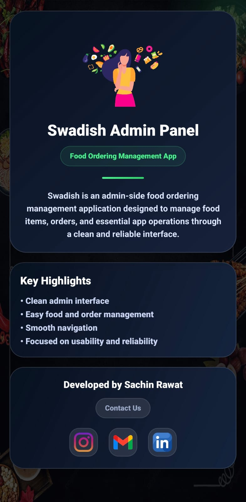
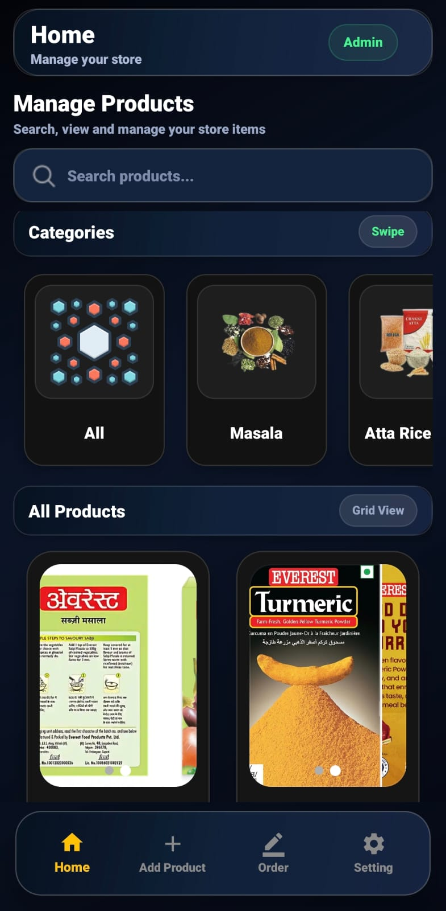
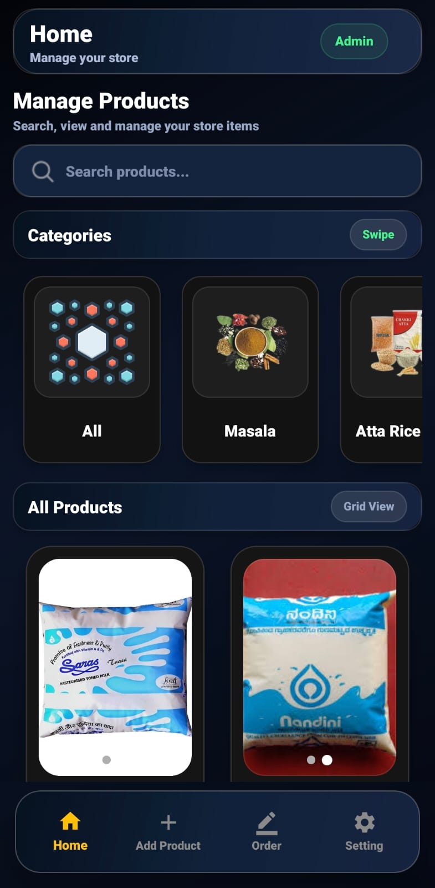
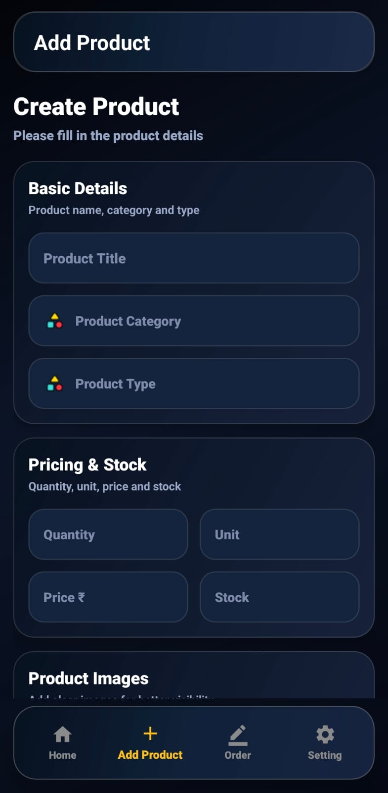
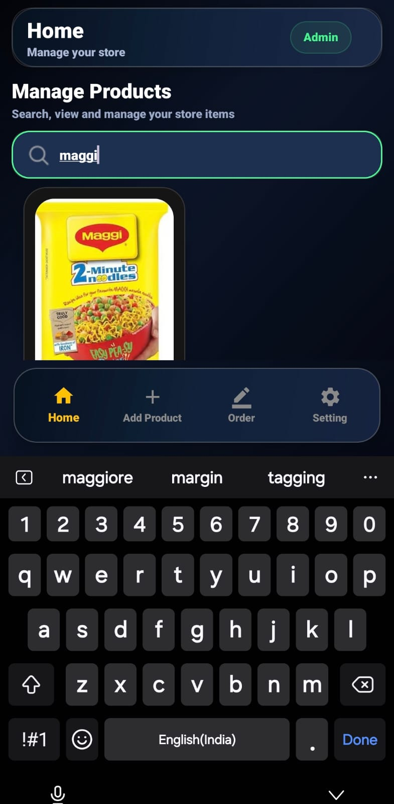
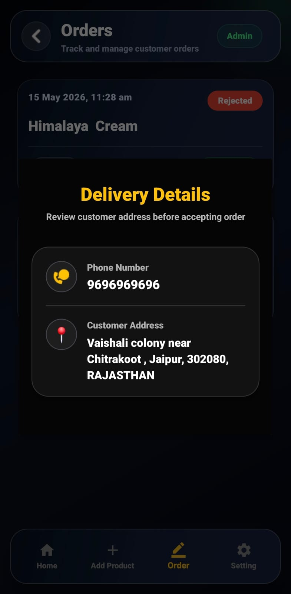
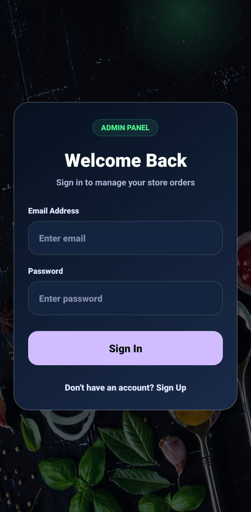
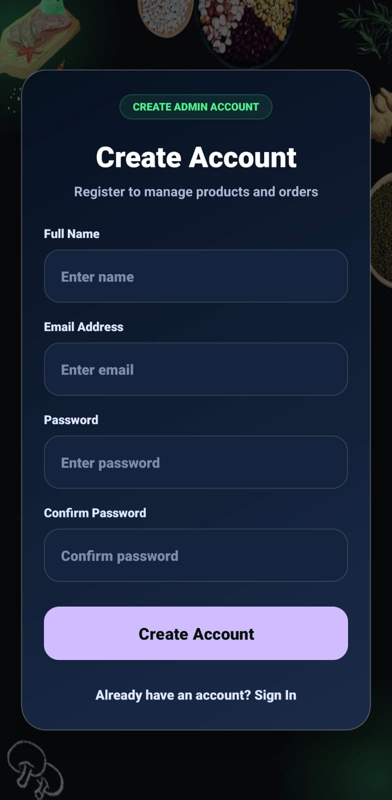

# Swadish_Admin_A_Delivery_App
Swadish Admin is an Android admin application developed with Kotlin and XML, powered by Firebase for real-time database and authentication. It allows administrators to manage food items, monitor orders, update order status, and control delivery flow efficiently.

## 📱 App Screenshots

<table align="center" cellpadding="12">
 <tr>
  <td></td>
  <td></td>
  <td></td>
  <td></td>
  <td></td>
</tr>
<tr>
  <td></td>
  <td></td>
  <td></td>
  <td></td>
  <td></td>
</tr>
<tr>
  <td></td>
</tr>
</table>

